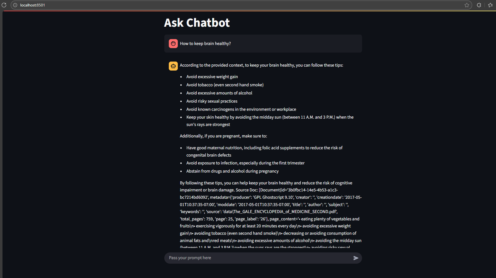

<div align="center">
<h1 align="center"> 🩺 MedChat </h1>

<p align="center"> <strong> A Chatbot based on actual medical data </strong> <p>
</div>

MedChat is an intelligent chatbot designed to assist users with basic medical queries. Built with python, it provides general health advice, symptom checks, and guidance on common conditions. 

> *This project is intended for educational and prototyping purposes—not a substitute for professional medical advice.*

## 🚀 Features

- 💬 Conversational interface for health-related questions
- 🧠 NLP-powered responses using RAG functionality
- 🩹 Symptom checker and general medical guidance
- 🔒 Privacy-conscious design (no data storage by default)

<div align="center">

</div>

## ⚠️ Disclaimer
MedChat is not a certified medical tool. It should not be used for diagnosis or treatment. Always consult a licensed healthcare provider for medical concerns.

## TechStack
 


## 🛠️ Installation

### 1. Clone the repository
```bash
git clone https://github.com/CodeNaveen-in/MedChat.git
cd MedChat
```
### 2. Add your env variables
- GROQ_API_KEY
- HF_TOKEN (It become paid as I was crafting it so I couldn't use it)

### 3. Create Virtual Environment
```bash
python -m venv .venv
```
### 4. Activate it 
Mine was on windows
```bash
.venv\Scripts\Activate.ps1
```

### 5. Install Dependencies
```bash
pip install -r requirements.txt
```

<br>

---

<footer align="center">

Made with Love by **CodeNaveen** 💖

</footer>